# **MovieRec**
Choosing a movie to watch is hard, and sticking with it is even harder, as there are a millions of movies to choose from!  

So, I present my first AIML project, a Movie recommendation system, using K-Nearest Neighbors memory-based collaborative filtering technique, which makes use of user ratings and genre to estimate a number of movies most simmilar to it.  

The user enters a movie, and movie title gets sent to Flask backend, where my Machine Learning Model performs KNN algorithm based on user ratings and genres, and gives 20 most similar movies to the one user entered.  

## **Demo:**
Deployed at: 

## __Technologies Used:__

Backend: 
* Flask API
* Python

Frontend: 
* ReactJS
* CSS

Model Training:
* Scikit-learn (Sklearn, Python library)

## Screenshots: 

### Home page:
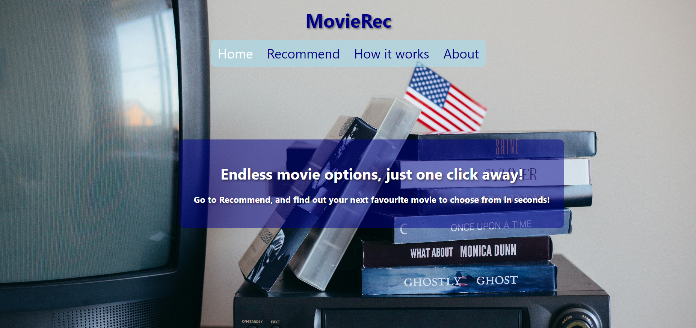

### Recommend page:
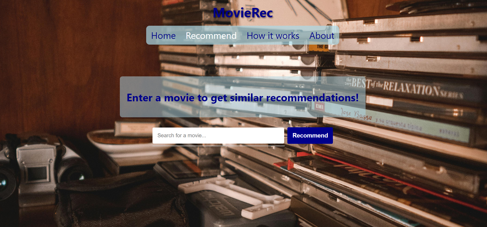

### Auto-Complete suggestions:
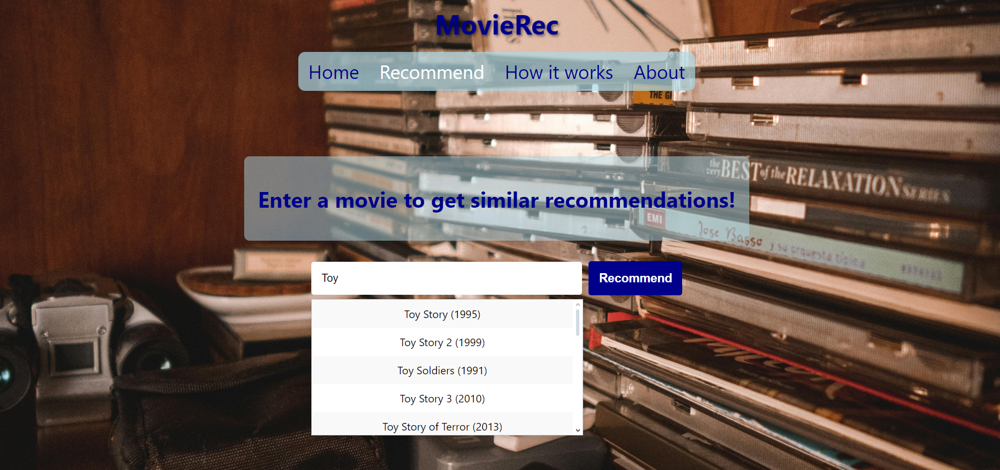

### Button changes to "Recommending....", whilst Flask API processes request:
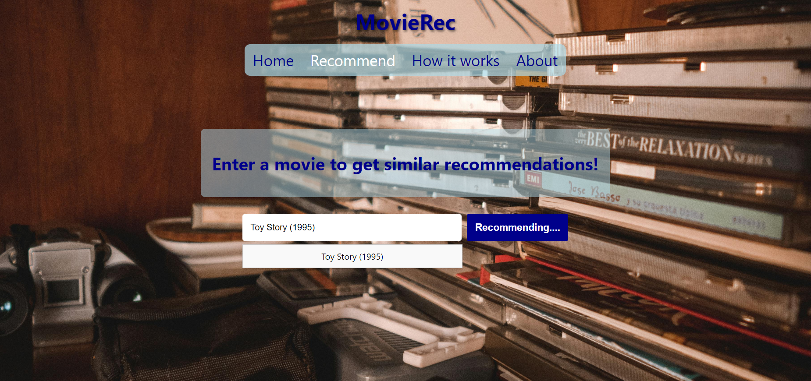

### Predictions page for Toy Story:
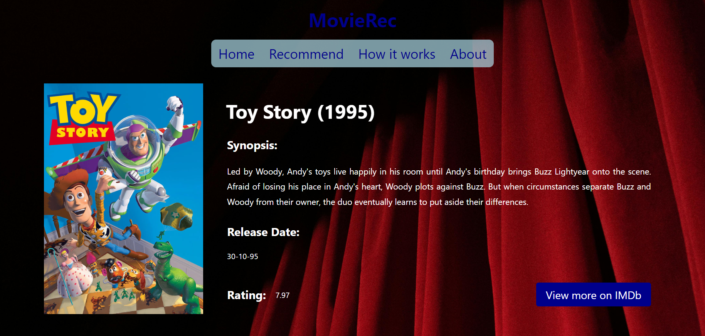

### 20 similar movies to Toy Story, based on ratings and genre, upon scroll:
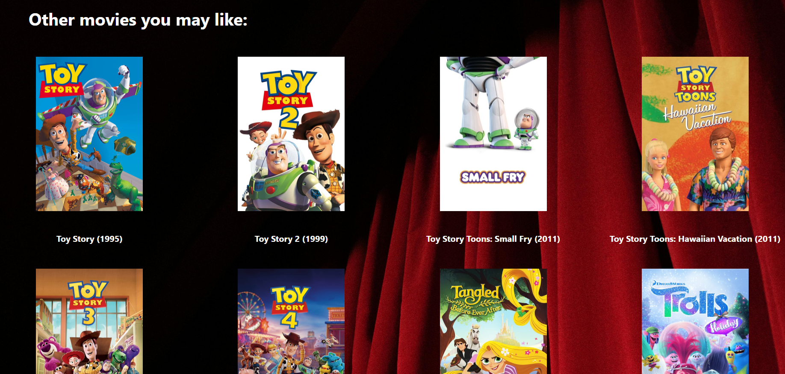
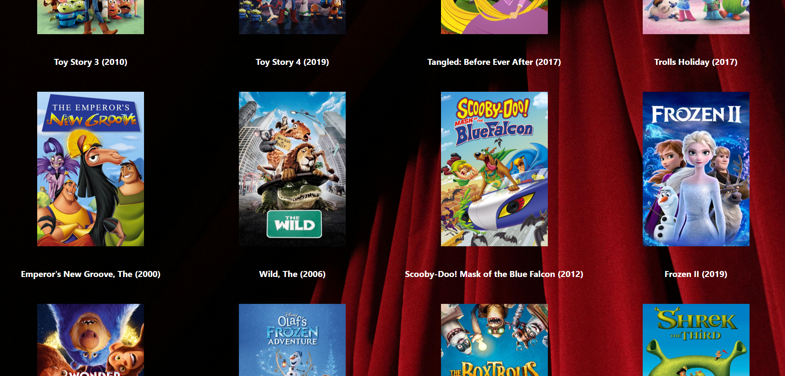
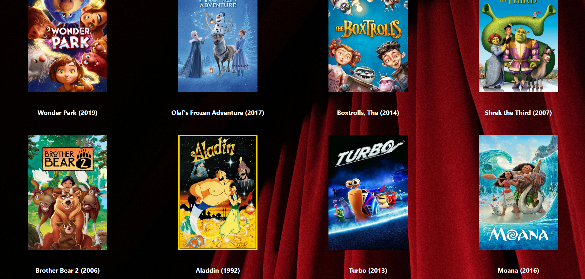

### How It Works page:
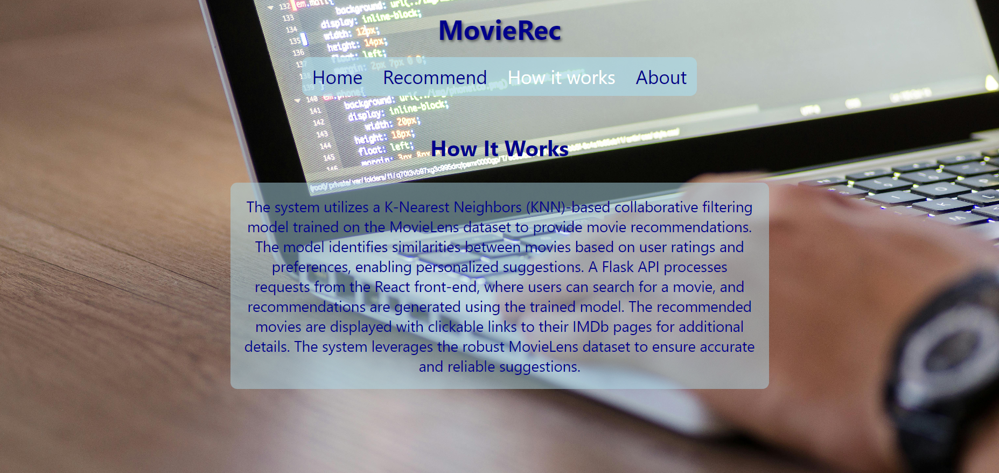

### About page:
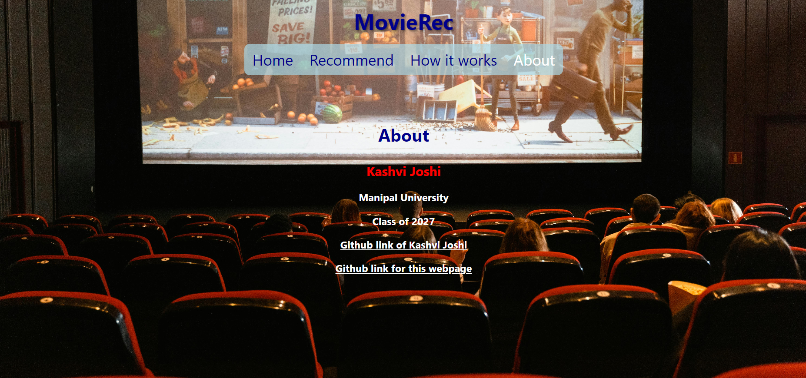

### Error-page, if movie not found, or user did not enter a movie:
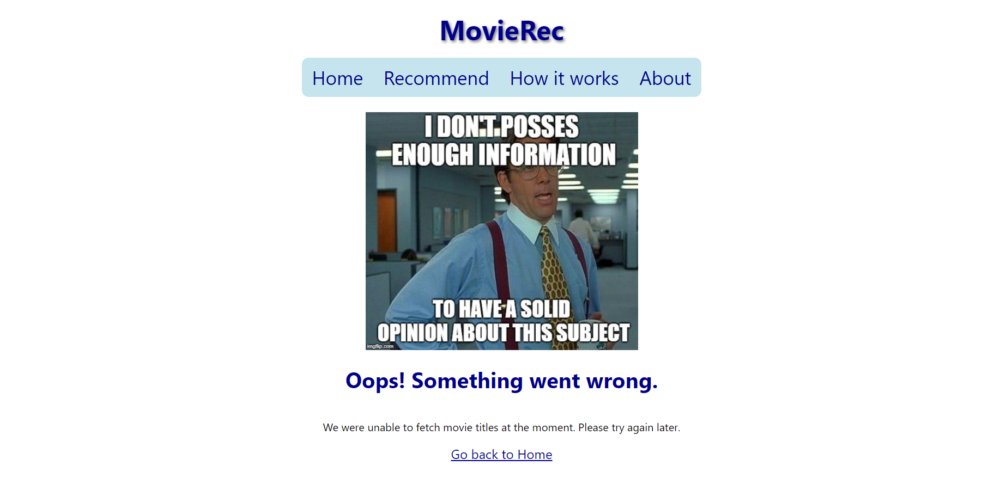

## __Usage:__
1.  User is greeted by the Homepage, from where user cango to Recommend page, How it works page, or About page.
2.  When user goes to Recommend page, user types the name of the movie, selects a movie from the suggestions list, and clicks the Recommend button.
3.  A page with the details of the chosen movie and list of predicted movies with links to their IMDb Pages is displayed.
4.  A user can click on the poster of any movie to be taken to it's respective IMDb Page.
5.  If a user clicks on the About page, they are redirected to a page, containing information about the creator of MovieRec.
6.  If a user clicks on the How It Works page, they are redirected to a page, containing information about how the page was created, and the logic behind it. 
7.  If a user clicks on Home page, they are redirected to the Homepage.
8.  If the user enters a movie which is not found in the dataset, or leaves the form blank, the user is redirected to an Apology page, from where the user can either access any other page through the navigation bar, or follow the link back to Home at the end of the page.

## __How It Works:__
1. The KNN-based model for the system was developed using Python, and the training was implemented on the MovieLens 25M dataset, which contains approximatly 25 million ratings for 62,423 movies spread out across various genres.

2. Preprocessing: In the system, Movie titles are cleaned to remove noise and ensure matching with the dataset, and genres are encoded using MultiLabelBinarizer (MLB), which performed genre encoding for categorical features like the genres into a binary matrix, making it easily processable. The TF-IDF (Term Frequency-Inverse Document Frequency) method was used for extracting genre features, which converted movie data like genres, ratings, and tags, into a numerical format suitable for similarity calculations. This creates a combined feature set for each movie.

3. Model training: The system utilizes the K-Nearest-neighbors (KNN) algorithm to recommend movies to users based on their preferences. KNN is trained on the combined feature space, which enables fast similarity lookups. 

4. Recommendations: Given an input movie, the similarity vector is calculated over all the movies available in the database, and the 20 most similar movies are returned by the Flask API, along with information from the TMDB (The Movie Database) API which has been used to get the poster paths and IMDb IDs of the movies. These are received by the React Frontend and then rendered in the web browser as output. 

5. Output: The result includes movie poster, synopsis, title, rating, release date, IMDb link for the user input, and 20 recommended movies posters and IMDb links leading to their detailed info page, all delivered in a visually-appealing, fresh, user-friendly format.

6. The system uses Flask as the backend to serve the recommendations and integrates easily with the React frontend to provided an intuitive user experience. 

## For running on Localhost:
* To get the full stack application up and running on your own localhost, you need to have NodeJS installed, alongside the requirements.txt file in the environment you are working in, and the MovieLens 25M Dataset, for movie information, with relevant csv files like movies.csv, links.csv, and ratings.csv placed in the correct project directory. 
* Making sure you are in the correct directory, run knn_model.py once to load the trained pickle file for the same.
* Then, you can run npm start for the frontend compilation, and flask run to get the backend running, at the same time in a split terminal, for the application to start running on your localhost. 

## Challenges Faced and Things Learnt:

This is my first AI-ML project, so Movie Recommendation System really caught my interest. I started with reading up about what are recommendation systems, their principles, the logic used, the agents needed, and different techniques on how to model a recommending system. Out of content-based and collaborative filtering, i settled on KNN, a content-based filtering technique, to filter the movies based on their genres and ratings. 

The next step was collecting movie data, which I did from MovieLens' 25M dataset, which includes 25 million ratings for over 62,423 movies. I started to train the model, using Pickle, and my built-in knn_model.py function to train the system and reduce noise and irrelevant recommendations, ensuring quality. 

Next was the frontend. Having worked with HTML, CSS and JavaScript before, I decided to learn ReactJS/NodeJS, instead of just plainly using HTML with Jinja syntax. I learned how to create multi-page React websites with visually-appealing UI and styles, conditional routing, use of hooks, states, handling and sending requests for certain data, and implemented a autocomplete feature with guidance from an AI, on how to go about that.

## Outside Help Employed:

1. CS50x Duck Debugger
2. ChatGPT for helping solve erroneous code, questions on how to implement model training, autocomplete features, and smooth API calls, ensuring no websocket or failed reachouts for data type ofonfig errors. 

=======

